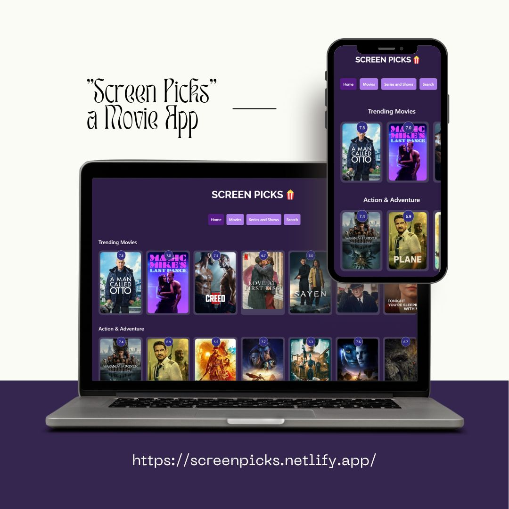

# Moviepicks : A Movie and Series App, created with React and Vite.

>API Used: TMDB https://www.themoviedb.org/documentation/api

<br>

## Tools used:


 
<h3 style="background-color: teal; width: fit-content; padding: 5px; font-weight: bold;">DaisyUI</h3>
<br>


## Features: 
    1. Onclick Modal with Movie information.
    2. Movie and Series page.
    3. Pagination.
    4. Genre Filtering.
    5. On Drag Scroll on Carousels.
    6. Search feature for Movie and Series Seperately with debouncing search.

<br>

## Live Link: 
>https://screen-picks.netlify.app/

<br>

## Overview:

<br>

## To Run Locally:

1. Clone the project 
````
git clone https://github.com/aryanamdev/screen-picks
````
2. Install Dependencies
````
npm install
````
3. Start local server
````
npm run dev
````
